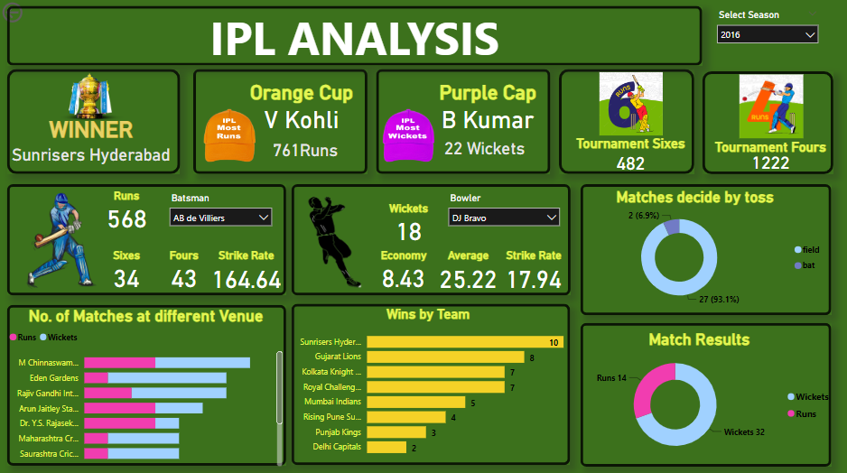

# 🏏 Power BI IPL Dashboard

This project showcases an interactive **Power BI Dashboard** built using Indian Premier League (IPL) data to uncover meaningful insights on players, teams, and match outcomes. It demonstrates data visualization, transformation, and storytelling through dynamic reports.

## 📊 Power BI Dashboard Preview

## 📊 Features

- Team-wise and season-wise performance overview
- Top batsmen and bowlers analysis
- Win % and toss decision patterns
- Venue-wise match outcomes
- Interactive slicers and filters for deep dive

## 📁 Project Structure

## ⚙️ Tools & Skills Used

- **Power BI** (DAX, Power Query, Charts, Slicers)
- **Data Cleaning**: Power Query Editor
- **Data Modeling** and relational design
- **Storytelling** using visuals and KPIs

## ✅ How to Use

1. Clone this repository or download the ZIP.
2. Open the `.pbix` file in **Power BI Desktop**.
3. Explore different pages, use filters and slicers to interact with the data.
4. Analyze insights on IPL teams, players, matches, and trends.

## 📌 Use Cases

- Sports analytics for cricket tournaments
- Data storytelling and BI dashboard project for portfolio
- Practice on real-world sports data using Power BI

## 🧑‍💻 Author

**Richanshu Yadav**  
[GitHub Profile](https://github.com/richanshu14)

